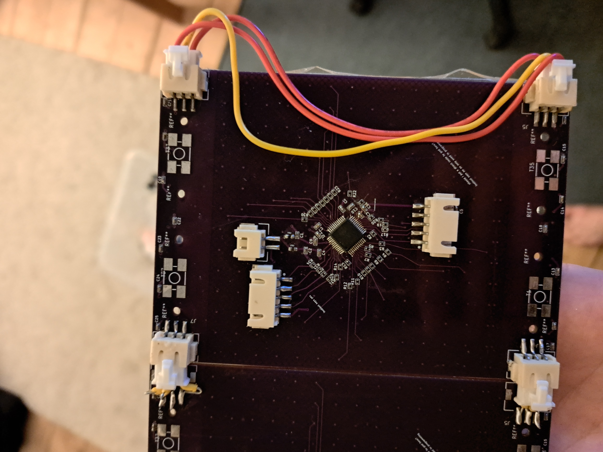
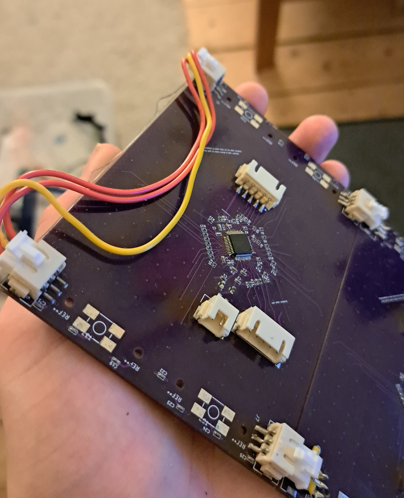

# Capacitive Touchpad

Capacitive Touchpad built around a PSoC 4 S-Series microcontroller with two rows of addressable RGB LEDs on the touchpad surface.  
A JST cable on the backside allows touch data to be transferred via SPI, with additional JST connectors on the sides to support daisy-chaining multiple touchpads.  
Designed in KiCad.

## Images

  
  
   
  
  
   
  
  

